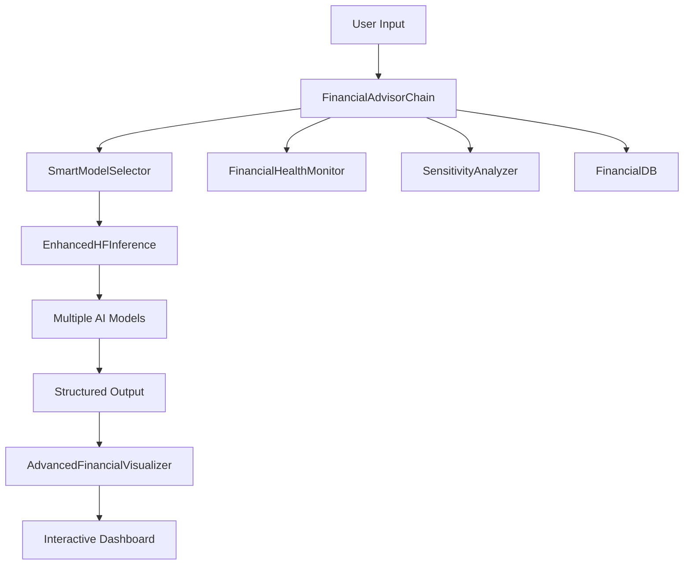

<div align="center">

# 🤖 AI Financial Advisor

<p align="center">
  
</p>


**An intelligent financial advisory platform powered by AI with multi-language support and advanced analytics**

[Features](#-features) • [Demo](#-demo) • [Installation](#-installation) • [Usage](#-usage) • [Architecture](#-architecture) • [Contributing](#-contributing)

</div>

---

## 📋 Overview

AI Financial Advisor is a comprehensive financial planning application that leverages artificial intelligence to provide personalized financial advice. Built with Streamlit and powered by Hugging Face models, it offers real-time analysis, interactive visualizations, and actionable insights in both English and Arabic.

### 🎯 Key Highlights

- **🧠 AI-Powered Analysis**: Utilizes multiple Hugging Face models for intelligent financial recommendations
- **🌍 Multi-Language Support**: Full support for English and Arabic interfaces
- **📊 Interactive Dashboards**: Beautiful, dark-themed visualizations with Plotly
- **💾 Persistent Storage**: SQLite database for tracking financial history
- **📈 Advanced Analytics**: Sensitivity analysis, health monitoring, and peer comparisons
- **🎨 Modern UI**: Custom dark theme with professional design

---

## ✨ Features

### 🔮 Core Capabilities

| Feature | Description |
|---------|-------------|
| **Smart Financial Planning** | AI-generated personalized savings and investment strategies |
| **Expense Categorization** | Automatic categorization of expenses with intelligent parsing |
| **Debt Management** | Snowball method calculator for optimal debt payoff planning |
| **Health Monitoring** | Real-time financial health scoring with actionable recommendations |
| **Sensitivity Analysis** | What-if scenarios to understand impact of savings changes |
| **Peer Benchmarking** | Compare your financial metrics against similar income groups |

### 🛠️ Advanced Tools

- **💰 Emergency Fund Calculator**: Calculate recommended emergency savings
- **📈 Compound Interest Simulator**: Project investment growth over time
- **💳 Debt Payoff Planner**: Create optimal debt elimination strategies
- **⚠️ Smart Alerts System**: Real-time notifications for financial concerns
- **📜 Historical Tracking**: Monitor progress with historical data visualization

### 🤖 AI Technology

- **Multi-Model Architecture**: Automatic selection of best AI model based on:
  - Language detection (English/Arabic)
  - Topic complexity (basic/advanced financial planning)
  - User query characteristics
- **Fallback Mechanisms**: Robust error handling with intelligent fallbacks
- **Structured Output Parsing**: Pydantic-based validation for reliable results

---

## 🎥 Demo

### Dashboard Overview


### Key Screens
- 💼 Main Analysis Dashboard
<p align="center">
  
</p>

- 📊 Visual Analytics Tab
<p align="center">
  
</p>
- ❤️ Health Monitoring
<p align="center">
  
</p>
- 🔧 Financial Calculators
<p align="center">
  
</p>
- 📜 Historical Tracking
<p align="center">
  
</p>
---

## 🚀 Installation

### Prerequisites

- Python 3.8 or higher
- pip package manager
- ngrok account (for deployment)

### Quick Start

1. **Clone the repository**
```bash
git clone https://github.com/yourusername/ai-financial-advisor.git
cd ai-financial-advisor
```

2. **Install dependencies**
```bash
pip install streamlit ngrok pyngrok pandas plotly requests langchain-core pydantic
```

3. **Run the application**
```bash
streamlit run app.py
```

### Using the Jupyter Notebook

If you prefer to run from the notebook:

```bash
jupyter notebook the-last-edition.ipynb
```

Then execute all cells sequentially. The notebook will:
1. Install required dependencies
2. Create the `app.py` file
3. Set up deployment scripts
4. Launch the application via ngrok

---

## 📖 Usage

### Basic Workflow

1. **Enter Financial Data** (Sidebar)
   - Monthly income
   - Fixed expenses (rent, utilities)
   - Variable expenses (food, transport)
   - Current savings
   - Existing debt
   - Financial goals
   - Risk tolerance

2. **Get AI Analysis**
   - Click "Analyze" to receive comprehensive financial advice
   - View personalized recommendations
   - Explore interactive visualizations

3. **Explore Analytics**
   - **Overview Tab**: Dashboard with key metrics
   - **Visual Analytics**: Interactive charts and graphs
   - **Health Monitor**: Financial health score and insights
   - **Smart Features**: Alerts, comparisons, and history
   - **Calculators**: Specialized financial tools

### Example Input

```python
{
    "income": 5000,
    "fixed_expenses": 2000,
    "variable_expenses": 1000,
    "savings": 10000,
    "debt": 5000,
    "goal": "Save for house down payment",
    "risk": "Moderate"
}
```

---

## 🏗️ Architecture

### Project Structure

```
ai-financial-advisor/
│
├── app.py                      # Main Streamlit application
├── deploy.py                   # Deployment script with ngrok
├── the-last-edition.ipynb      # Jupyter notebook version
├── financial_data.db           # SQLite database (auto-created)
└── README.md                   # This file
```

### Core Components



### Key Classes

| Class | Purpose |
|-------|---------|
| `FinancialAdvisorChain` | Main orchestration logic for financial analysis |
| `SmartModelSelector` | Intelligent AI model selection based on context |
| `EnhancedHFInference` | Hugging Face API integration with retry logic |
| `FinancialHealthMonitor` | Health scoring and monitoring system |
| `SensitivityAnalyzer` | What-if analysis and scenario planning |
| `AdvancedFinancialVisualizer` | Chart generation and data visualization |
| `FinancialDB` | SQLite database management |

---

## 🎨 Customization

### Theme Configuration

The application uses a custom dark theme. To modify colors, edit the `inject_dark_theme()` function in `app.py`:

```python
def inject_dark_theme():
    st.markdown("""
    <style>
    :root {
        --primary-color: #6366f1;      # Indigo
        --secondary-color: #8b5cf6;    # Purple
        --success-color: #10b981;      # Green
        --warning-color: #f59e0b;      # Amber
        --danger-color: #ef4444;       # Red
        --background: #0a0a0a;         # Black
        --surface: #1a1a1a;            # Dark Gray
    }
    </style>
    """)
```

### AI Models

To add or modify AI models, update the `SmartModelSelector` class:

```python
self.models = {
    'basic_en': "model-url-here",
    'advanced_en': "model-url-here",
    'arabic': "model-url-here"
}
```

---

## 📊 Data Schema

### User Input Schema
```json
{
    "income": "float",
    "fixed_expenses": "string or float",
    "variable_expenses": "string or float",
    "savings": "float",
    "debt": "float",
    "goal": "string",
    "risk_tolerance": "string (Low/Moderate/High)"
}
```

### Output Schema
```json
{
    "spending_changes": [
        {"category": "string", "current": "float", "suggested": "float", "reason": "string"}
    ],
    "saving_plan": {
        "monthly_amount": "float",
        "emergency_fund": "float",
        "milestones": []
    },
    "investment_plan": {
        "strategy": "string",
        "asset_allocation": {}
    },
    "health_score": {
        "overall": "int",
        "debt_ratio": "float",
        "savings_rate": "float",
        "emergency_coverage": "float"
    }
}
```

---

## 🔒 Security & Privacy

- ⚠️ **No Data Collection**: All data is stored locally in SQLite
- 🔐 **API Security**: Hugging Face inference uses serverless endpoints
- 💾 **Local Storage**: Financial data never leaves your machine
- 🌐 **ngrok Tunneling**: Secure HTTPS tunnel for deployment

> **Note**: For production use, implement proper authentication and encryption

---

## 🧪 Testing

### Manual Testing
```bash
# Run the app locally
streamlit run app.py

# Test with sample data
# Use the sidebar to input test values
```

### Future Enhancements
- Unit tests with pytest
- Integration tests for AI models
- Performance benchmarks
- Load testing for concurrent users

---

## 🤝 Contributing

Contributions are welcome! Here's how you can help:

1. **Fork the repository**
2. **Create a feature branch**
   ```bash
   git checkout -b feature/AmazingFeature
   ```
3. **Commit your changes**
   ```bash
   git commit -m 'Add some AmazingFeature'
   ```
4. **Push to the branch**
   ```bash
   git push origin feature/AmazingFeature
   ```
5. **Open a Pull Request**

### Development Guidelines

- Follow PEP 8 style guidelines
- Add docstrings to new functions
- Update README with new features
- Test thoroughly before submitting PR

---

## 📝 Roadmap

- [ ] User authentication system
- [ ] Export reports to PDF
- [ ] Integration with banking APIs
- [ ] Mobile-responsive design
- [ ] Multi-currency support
- [ ] Advanced ML models for predictions
- [ ] Social features (anonymous benchmarking)
- [ ] Notification system (email/SMS)

---

## 🐛 Known Issues

- Large expense strings may cause parsing delays
- ngrok tunnel requires manual setup
- Historical data visualization limited to 10 records
- Some AI models may timeout under heavy load

---

## 📄 License

This project is licensed under the MIT License - see the [LICENSE](LICENSE) file for details.

```
MIT License

Copyright (c) 2024 AI Financial Advisor

Permission is hereby granted, free of charge, to any person obtaining a copy
of this software and associated documentation files (the "Software"), to deal
in the Software without restriction...
```

---

## 👥 Authors

- **Ahmed Hussein**  - [MyGitHub](https://github.com/A7med668)

---

## 🙏 Acknowledgments

- **Streamlit** - For the amazing web framework
- **Hugging Face** - For providing powerful AI models
- **Plotly** - For beautiful interactive visualizations
- **LangChain** - For structured output parsing
- **The Open Source Community** - For inspiration and support

---

## 📧 Contact

- **Project Link**: [https://github.com/A7med668/ai-financial-advisor](https://github.com/A7med668/ai-financial-advisor)
- **Issues**: [https://github.com/A7med668/ai-financial-advisor/issues](https://github.com/A7med668/ai-financial-advisor/issues)
- **Discussions**: [https://github.com/A7med668/ai-financial-advisor/discussions](https://github.com/A7med668/ai-financial-advisor/discussions)

---

## 📚 Documentation

For detailed documentation, please visit:
- [User Guide](docs/USER_GUIDE.md)
- [API Reference](docs/API.md)
- [Deployment Guide](docs/DEPLOYMENT.md)

---

<div align="center">

### ⭐ Star this repository if you find it helpful!

**Made with ❤️ and ☕ by passionate developers**

[⬆ Back to Top](#-ai-financial-advisor---مستشار-مالي-ذكي)

</div>
